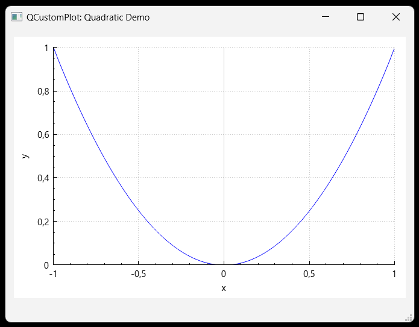

# QCustomPlot
QCustomPlot is a Qt C++ widget for plotting and data visualization. It has no further dependencies and is well documented. This plotting library focuses on making good looking, publication quality 2D plots, graphs and charts, as well as offering high performance for realtime visualization applications. Have a look at the Setting Up and the Basic Plotting tutorials to get started.  QCustomPlot can export to various formats such as vectorized PDF files and rasterized images like PNG, JPG and BMP. QCustomPlot is the solution for displaying of realtime data inside the application as well as producing high quality plots for other media.

Author: Emanuel Eichhammer

QCustomPLot is under default license GPL, feel free to use QCP in free software! Visit https://www.qcustomplot.com for commertial license and more information!

# Screenshots

